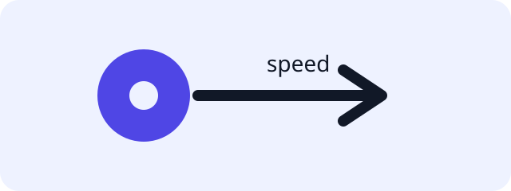

Welcome to the DASC lab starter project.

## Unicycle forward dynamics

Complete the following exercise:

[Unicycle forward dynamics — UnicycleDynamics.f (src/dasc_lab/dynamics/unicycle.py:7-9)](https://marshallvielmetti.github.io/dasc_lab_starter_project/releases/v0.1.0/source/src/dasc_lab/dynamics/unicycle.py.html#L7-L9)

!!! note "Learning goal"
    Implement the smallest dynamics function first, then use the public test to check its observable behavior.

For the example model, the commanded forward speed is carried into the first derivative component while the second state component is preserved.

